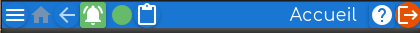

L'écran de l'application affiche à tout instant une **page** dont le nom apparaît en haut à droite de l'écran: selon les actions effectuées la page courante est remplacée par une autre adaptée à la fonctionnalité souhaitée.

A certains moments la page courante peut être partiellement recouverte:
- par un panneau qui vient de la droite et peut être fermé en appuyant sur sa flèche orange en haut à droite.
- par un panneau de recherche qui vient de la gauche qui peut être fermé par appui sur sa flèche orange en haut à droite du panneau.
- par des _boîtes de dialogues_ qui s'affiche au centre avec des informations détaillées et souvent la possibilité d'effectuer des saisies. Elles se ferment par appui sur la croix orange en haut à droite de la boîte.

Techniquement on ne peut pas _fermer_ l'application depuis l'application: le bouton en haut à gauche de _déconnexion_ affiche ... la page de connexion. Pour quitter définitivement l'application il faut **au niveau du browser**, 
- soit fermer l'onglet de l'application, 
- soit naviguer vers une autre page Web dans la barre d'adresse du browser ou ses flèches _page précédente /  suivante_.
- soit fermer le navigateur lui-même.

> Remarque: l'application peut être affichée en plein écran en agissant au niveau du browser, en général par la touche F11 (Firefox, Chrome ...). 

## Connexion / déconnexion
Une fois ouverte l'application propose de se connecter à un compte qui devient le _compte courant_. On peut à tout instant se déconnecter du compte courant ce qui ramène à la page de _connexion_ qui propose de choisir un compte.

Ainsi l'application dans le browser vit plusieurs _sessions_ successives, chacune ouverte sur un compte puis déconnectée de celui-ci.

### Navigation d'une page à une autre
C'est toujours une action volontaire de l'utilisateur qui permet de passer à une autre page, de voir une autre partie des données du compte.
- la page actuellement affichée glisse vers la gauche et disparaît,
- la nouvelle page arrive de la droite et remplace l'ancienne.

# Structure des pages | top_bar bottom_bar page_accueil

Toutes les **pages** se présentent avec:
- **une barre en haut**, réduite pour la page de connexion.
- **le contenu de la page** propre à la page actuellement affichée.
- **une barre en bas**.

### Page d'accueil
Au cours d'une session connectée à un compte, on peut à tout instant revenir à la **page d'accueil** en appuyant sur l'icône _maison_: de cette page toutes les fonctionnalités sont accessibles.

### Barre du haut

### Barre du bas

### Contenu d'une page
Selon la page affichée, on voit:
- **une barre d'onglets**, chaque onglet ayant un contenu et une fonctionnalité bien définie. La majorité des pages n'ont pas d'onglets.
- **un panneau latéral à droite de _recherche_**, seulement certaines pages ont un panneau de recherche.

### Panneau de recherche
Une icône en forme de **loupe** en haut à droite ouvre le panneau de recherche. Toutefois si l'écran a une largeur suffisante, la panneau est ouvert par défaut et le reste.

Une icône avec **une flèche orangée en haut à gauche** du panneau de recherche permet de le masquer.
